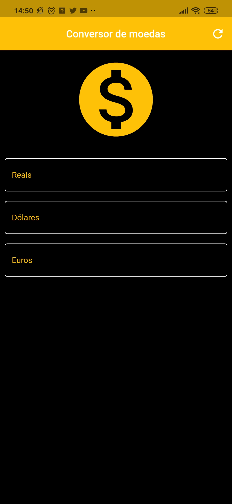
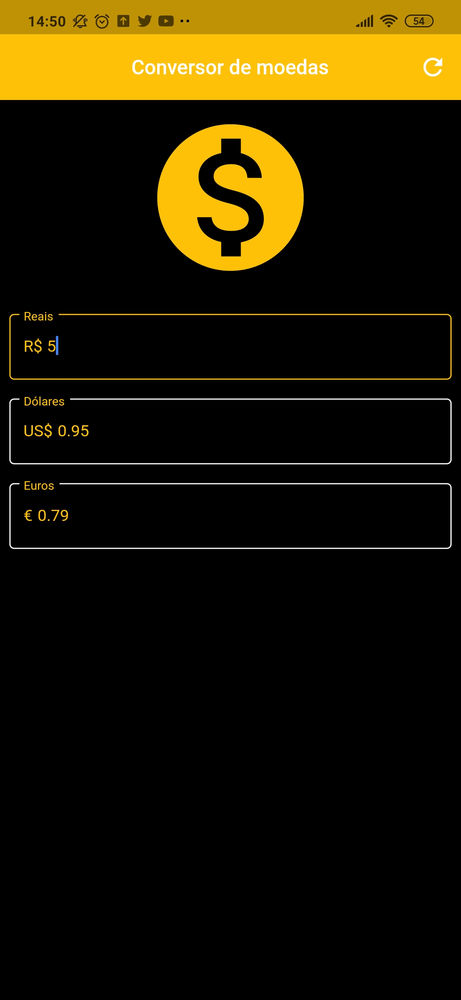
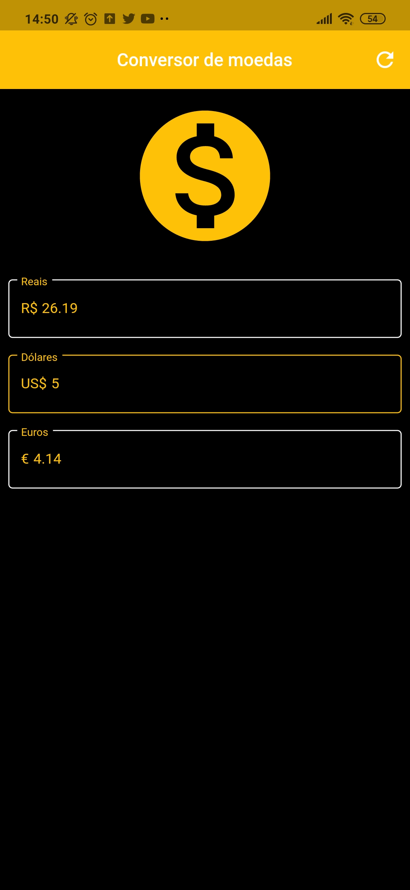
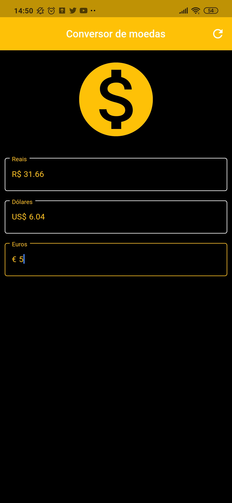

# conversorMoedas
 
App utilizando flutter no qual tem o objetivo é realizar a conversão de valores Real-Dólar-Euro, utilizando API para isso pegando o valor real e atual.
Sendo que o resultado da pesquisa é mostrado instantaneamente enquanto digita.

